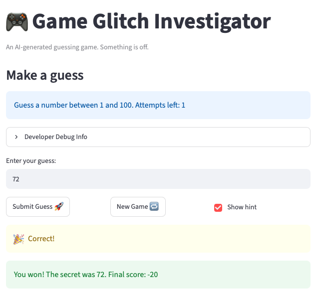

# 🎮 Game Glitch Investigator: The Impossible Guesser

## 🚨 The Situation

You asked an AI to build a simple "Number Guessing Game" using Streamlit.
It wrote the code, ran away, and now the game is unplayable. 

- You can't win.
- The hints lie to you.
- The secret number seems to have commitment issues.

## 🛠️ Setup

1. Install dependencies: pip install -r requirements.txt
2. Run the broken app: python -m streamlit run app.py

## 🕵️‍♂️ Your Mission

1. **Play the game.** Open the "Developer Debug Info" tab in the app to see the secret number. Try to win.
2. **Find the State Bug.** Why does the secret number change every time you click "Submit"? Ask ChatGPT: *"How do I keep a variable from resetting in Streamlit when I click a button?"*
3. **Fix the Logic.** The hints ("Higher/Lower") are wrong. Fix them.
4. **Refactor & Test.** - Move the logic into logic_utils.py.
   - Run pytest in your terminal.
   - Keep fixing until all tests pass!

## 📝 Document Your Experience

- [x] Describe the game's purpose.
- [x] Detail which bugs you found.
- [x] Explain what fixes you applied.

Purpose: Streamlit number-guessing game where the player tries to find a secret number within a limited number of attempts, using "higher/lower" hints and difficulty levels that set the range and attempt limit.

Bugs found:
1. Hints were backwards: a guess above the secret said "Go HIGHER" and a guess below said "Go LOWER."
2. The first game gave 7 attempts while every game after gave 8.
3. The secret number changed on every Submit, so the game was effectively unwinnable.
4. Out-of-range guesses (like -1 or 101) were accepted and still used up an attempt.

Fixes applied:
- Corrected the high/low logic in check_guess so the hint direction matches the guess.
- Added range validation in parse_guess(raw, low, high) so out-of-range guesses are rejected, and moved the attempt counter so only valid guesses count.
- Refactored check_guess and parse_guess into logic_utils.py and updated the imports in app.py.
- Added pytest cases covering the hint direction and range validation, and fixed pre-existing tests that compared the result tuple to a plain string (now 9/9 passing).


## 📸 Demo Walkthrough

Describe your fixed game in numbered steps so a reader can follow along without watching a video:

1. User enters a guess of 50
2. Game returns "Too Low"
3. User enters a guess of 75 → "Too High"
4. Score updates correctly after each guess
5. Game ends after the correct guess or you run out guesses
6. Click "New Game" if you want to try again

**Screenshot** *(optional)*: <!-- Insert a screenshot of your fixed, winning game here -->


## 🧪 Test Results

```
(.venv) kushalrajam@Mac ai110-module1show-gameglitchinvestigator-starter % python -m pytest
===================== test session starts ======================
platform darwin -- Python 3.13.13, pytest-9.0.3, pluggy-1.6.0
rootdir: /Users/kushalrajam/AI110 Class Work/ai110-module1show-gameglitchinvestigator-starter
plugins: anyio-4.13.0
collected 9 items                                              

tests/test_game_logic.py .........                       [100%]

====================== 9 passed in 0.02s =======================
```

## 🚀 Stretch Features

- [ ] [If you choose to complete Challenge 4, describe the Enhanced UI changes here — a screenshot is optional]
